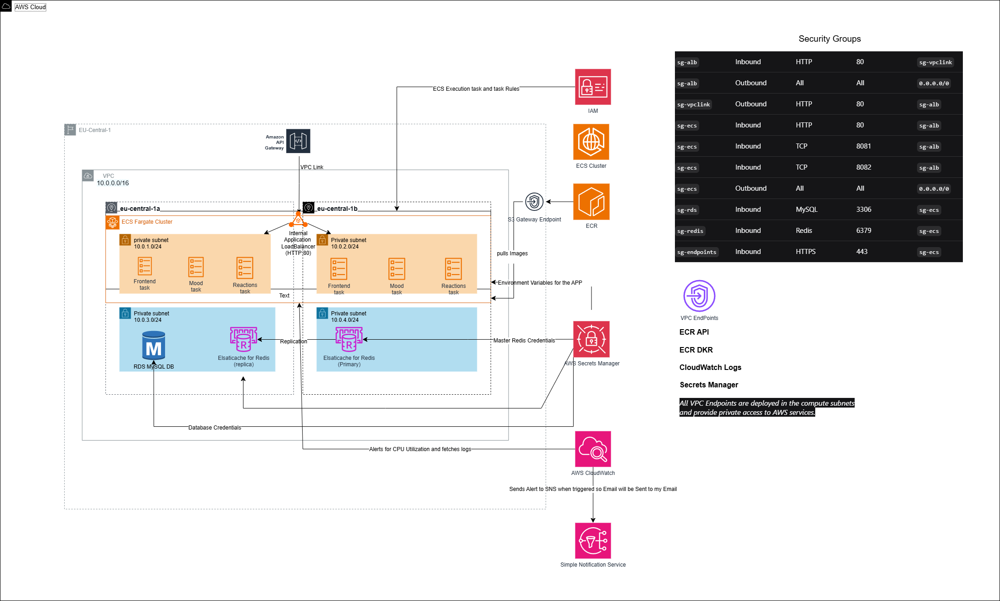

# Architecture Deep Dive

This document explains why every architectural choice was made for the Buzzboard AWS deployment.

## System Overview

## Screenshots


*Project Architecture*

---

## Architectural Decisions & Justifications

### 1. ECS Fargate (not EC2, Lambda, or Kubernetes)

**Decision:** Use ECS Fargate for container orchestration.

**Why Fargate?**
- **Serverless containers:** No cluster management overhead (vs EC2)
- **Auto-restart:** Tasks restart automatically on failure
- **Health checks:** Built-in integration with ALB
- **Pricing:** Pay per vCPU/memory/hour, not per instance
  - Fargate: ~$0.04/hour per task
  - EC2: ~$0.10/hour per instance
  - Lambda: Not suitable for long-running services
- **Cost for this app:** 3 tasks × 0.5 vCPU × $0.04 = $0.06/hour

**Why not Kubernetes (EKS)?**
- EKS costs $0.10/hour for control plane alone
- The Project is only 3 Microservices which doesn't need EKS power to handle it.

**Why not Lambda?**
- These are long-running services (reactions + mood), not event-driven

---

### 2. Internal ALB (not direct VPC Link to ECS)

**Decision:** Use Application Load Balancer between VPC Link and ECS tasks.

**Why ALB?**
- **Path-based routing:** Route `/reactions*` to reactions service, `/mood*` to mood service and finally `/auth/*` for the authentication
- **Health checks:** ALB verifies tasks are healthy before sending traffic
- **Sticky sessions:** Option for session persistence (if needed later)
- **Cost:** ~$0.0225/hour for internal ALB (minimal)

**Why not direct VPC Link?**
- VPC Link can only target NLB or ALB
- Direct routing would require infrastructure change for routing logic
- ALB provides routing intelligence for multi-service setup

---

### 3. Private Networking (no NAT Gateway)

**Decision:** All subnets private. No internet gateway. Use VPC Endpoints instead of NAT Gateway.

**Why private-only?**
- **Security:** Databases never exposed to internet
- **Compliance:** Zero inbound from internet except through API Gateway
- **Simplicity:** No IGW management

---

### 4. 4 Private Subnets Across 2 AZs

**Subnet Layout:**
```
eu-central-1a                    eu-central-1b
├─ compute-subnet-a (10.0.1.0/24) ├─ compute-subnet-b (10.0.2.0/24)
│  2 ECS tasks (reactions, mood,  │  2 ECS tasks (reactions, mood,
│  1 frontend task)               │  1 frontend task)
└─ data-subnet-a (10.0.3.0/24)    └─ data-subnet-b (10.0.4.0/24)
   RDS MySQL (1a)
   ElastiCache Redis Replica         ElastiCache Redis Primary (1b)
```

**Why 2 AZs?**
- ALB requires subnets in at least 2 AZs (AWS requirement)
- If 1a goes down, ALB still has targets in 1b (High Availability)
- Compute can span AZs, but data is single-AZ (free tier)

**Why 4 subnets instead of 2?**
- Separation of concerns: compute resources vs data resources
- Security: RDS and Redis isolated from compute traffic
- Scalability: Can expand each tier independently

**Why not Multi-AZ RDS/Redis?**
- Free tier allows 750 hours RDS/month = single AZ
- Production would use Multi-AZ for HA

---

### 5. RDS MySQL 

**Decision:** RDS MySQL on db.t3.micro.

**Why RDS?**
- Managed service (AWS patches, backups, monitoring)
- Free tier eligible (~750 hours/month)
- ACID transactions (important for auth + reactions)
- Cost: ~$0.017/hour (free tier)


---

### 6. ElastiCache Redis 

**Decision:** ElastiCache Redis with 1 replica.

**Why Redis?**
- **In-memory:** Fast caching (1ms vs 10ms for MySQL)
- **TTL support:** Automatic expiration of cache keys
- **Observable:** App shows "Source: Redis" vs "Source: MySQL" — great for learning
- **Free tier:** 750 hours/month
- **Cost:** ~$0.017/hour

**Why 1 replica instead of 0?**
- Replica provides read scaling and failover
- Slight cost increase (~$0.017 more/hour)
- Good practice, observable improvement in app performance

---

### 7. API Gateway (not ALB directly on internet)

**Decision:** API Gateway HTTP API as public entry point.

**Why API Gateway?**
- **DDoS protection:** AWS Shield integration
- **Rate limiting:** Built-in throttling
- **Auth:** Can add API keys, Lambda authorizers (future)
- **Monitoring:** CloudWatch integration
- **Cost:** Free tier for 1M requests/month
- **Simplicity:** No need to manage public ALB

**Why HTTP API instead of REST API?**
- REST API is legacy, with more overhead
- HTTP API is newer, simpler, lower-cost
- Sufficient for this project's needs
- Price: Same (effectively free tier)

**Why not CloudFront?**
- Not needed for simple app
- Would add caching layer (nice-to-have, not critical)
- For 24-hour test: overkill

---

### 8. Secrets Manager 

**Decision:** Store credentials in AWS Secrets Manager, reference in task definitions.

**Why Secrets Manager?**
- **No secrets in logs:** Env vars appear in CloudWatch logs (bad)
- **No secrets in code:** Secrets never hardcoded
- **Audit trail:** CloudTrail logs all secret access
- **Rotation-ready:** Can rotate without redeploying
- **Cost:** ~$0.00005/secret/hour (virtually free)

**Why not .env files?**
- Risk of committing to GitHub
- No audit trail
- Hard to rotate

---

### 9. CloudWatch Logs 

**Decision:** CloudWatch Logs for container logging.

**Why CloudWatch?**
- **Native AWS:** No extra infrastructure
- **Free:** Within free tier limits
- **Integration:** Works seamlessly with ECS, Alarms, CloudTrail
- **Retention:** Configurable (7-365 days)


---

### 10. SNS for Email Alerts 

**Decision:** SNS topic subscribed to email.

**Why SNS?**
- **Native AWS:** Built-in, no third-party service
- **Free tier:** Includes email
- **Simple:** CloudWatch alarms → SNS → email
- **Cost:** $0 for email subscriptions

---

## Security Posture

### Network Security

| Layer | Control |
|-------|---------|
| Internet | API Gateway + AWS Shield (DDoS protection) |
| Public endpoint | HTTPS only |
| VPC | No IGW, no NAT (minimal attack surface) |
| Subnets | All private, isolated by purpose |
| Access | Security groups enforce least privilege |
| Secrets | Secrets Manager (no hardcoding) |

### Data Security

| Component | Protection |
|-----------|-----------|
| RDS | Encryption at rest + in transit, backups, point-in-time recovery |
| Redis | Auth token + in-transit encryption |
| Logs | CloudWatch with IAM access control |
| API | HTTPS (managed by API Gateway) |

### Application Security

| Feature | Implementation |
|---------|-----------------|
| Authentication | JWT (stateless) |
| Password hashing | bcrypt |
| Secrets | AWS Secrets Manager |
| Logging | No credentials in logs |


---

## Scalability Considerations

**Current setup:** 1 task per service (can be increased easily)

**To add auto-scaling:**
```
ECS Service → Auto Scaling → Target tracking
  - Scale up when CPU > 70%
  - Scale down when CPU < 30%
  - Min tasks: 1, Max tasks: 4
```

**To add geographic distribution:**
```
Add CloudFront edge locations + route 53
API Gateway URL → CloudFront → to nearest region
```

**To add database read replicas:**
```
RDS → Create read replica in different AZ
App → Route SELECT queries to replica
```

---

## Cost Optimization

### Current costs (~24 hours):
- ECS Fargate: $1.62 (3 × 0.5 vCPU/1GB × 24h)
- ALB: $0.54 (minimal LCU)
- RDS: $0.41 (free tier)
- Redis: $0.82 (free tier)
- VPC Endpoints: $0.96 (4 × 24h × $0.01)
- **Total: ~$4.35**

### Ways to reduce further:
- Stop/start instead of continuous run: -90%
- Use Lambda for API instead of ECS: -80%
- Remove replica from Redis: -50%
- Use only 1 AZ: not recommended for HA

### Ways to reduce for production:
- Reserved instances: -40%
- Spot instances for non-critical: -70%
- Schedule down during off-hours: -50%

---

## What Would Change for Production

| Aspect | Test (Current) | Production |
|--------|--------|------------|
| **HA** | Single AZ | Multi-AZ RDS, Redis replica |
| **Backups** | 7 days | 30+ days, tested recovery |
| **Monitoring** | Basic alarms | Custom dashboards, APM |
| **Security** | Basic SGs | WAF, network ACLs, VPC Flow Logs |
| **Scaling** | Manual (desired count) | Auto-scaling groups, Lambda |
| **DNS** | API Gateway URL | Custom domain + Route 53 |
| **TLS** | AWS managed | Certificate Manager |
| **Code** | Single version | Blue-green deployments, canary |
| **Database** | Single instance | Multi-region read replicas |
| **Cache** | Single cluster | Redis Cluster mode for sharding |

---

## Lessons Learned

1. **VPC Endpoints save money** compared to NAT Gateway (~$10/month per deployment)
2. **Fargate is simple** but less flexible than EC2 for complex needs
3. **Secrets Manager is essential** — environment variables leak credentials
4. **CloudWatch is powerful** — logs, metrics, alarms all integrated
5. **Path-based ALB routing** is perfect for microservices
6. **Free tier services** make PoCs affordable (~$0 with credits)

---

## References

- [AWS ECS Best Practices](https://docs.aws.amazon.com/AmazonECS/latest/bestpracticesguide/intro.html)
- [VPC Endpoints Guide](https://docs.aws.amazon.com/vpc/latest/privatelink/vpc-endpoints.html)
- [RDS Free Tier](https://aws.amazon.com/rds/free/)
- [ElastiCache Free Tier](https://aws.amazon.com/elasticache/free-tier/)
