# Screenshots Gallery – Buzzboard AWS Deployment

This document contains all screenshots captured during the deployment and testing of the Buzzboard AWS infrastructure. The images are organized to show the complete journey from infrastructure setup to application functionality.

All images are located in the `/screenshots` folder.

---

## 🏗️ Infrastructure & Networking

### 1. VPC Resource Map
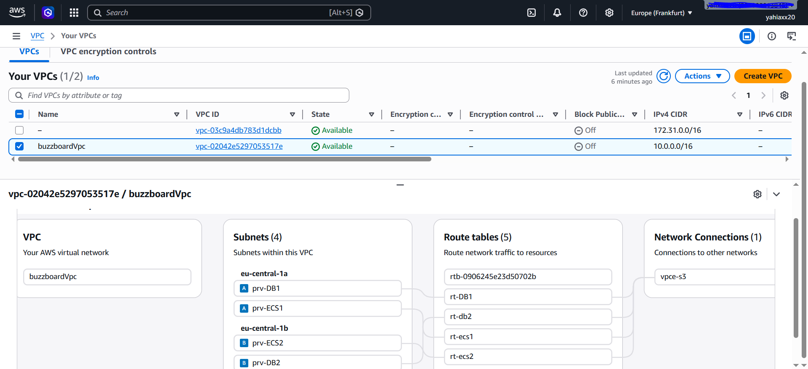
*VPC `buzzboardVpc` (CIDR `10.0.0.0/16`) with four subnets split across two Availability Zones, route tables, and network connections.*

### 2. VPC Endpoints (PrivateLink)
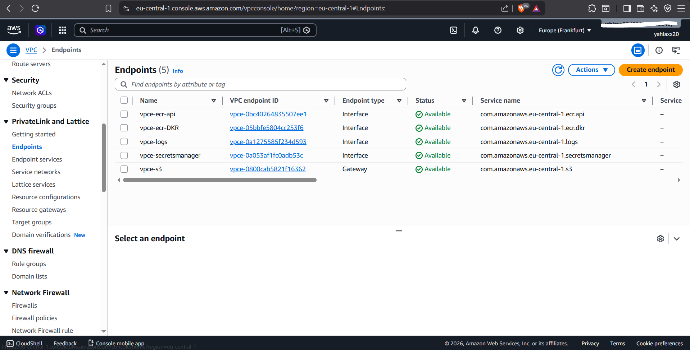
*Five VPC Endpoints allow private access to AWS services without a NAT Gateway: ECR API, ECR DKR, CloudWatch Logs, Secrets Manager, and S3 Gateway.*

### 3. Security Groups (7 total)
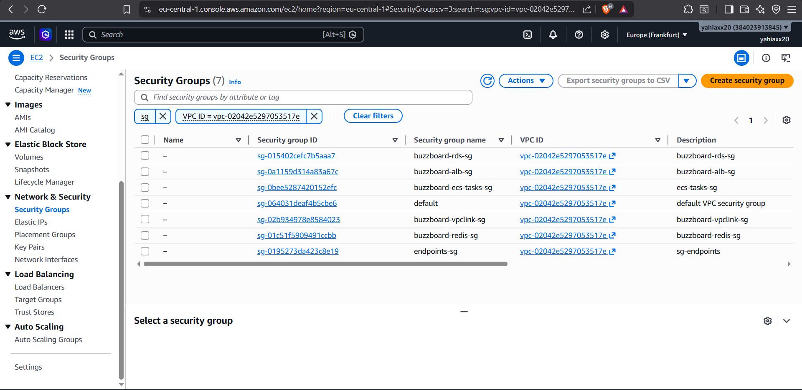
*Security groups include `buzzboard-alb-sg`, `buzzboard-ecs-tasks-sg`, `buzzboard-rds-sg`, `buzzboard-redis-sg`, `buzzboard-vpclink-sg`, `endpoints-sg`, and `default`.*

---

## ⚖️ Load Balancing

### 4. Internal Application Load Balancer
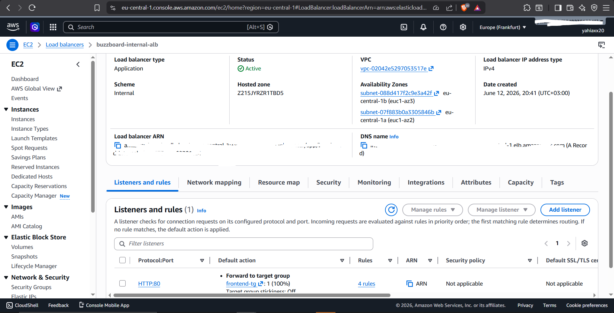
*Internal ALB `buzzboard-internal-alb` (scheme internal, listener HTTP:80) with path‑based routing rules.*

### 5. Target Groups
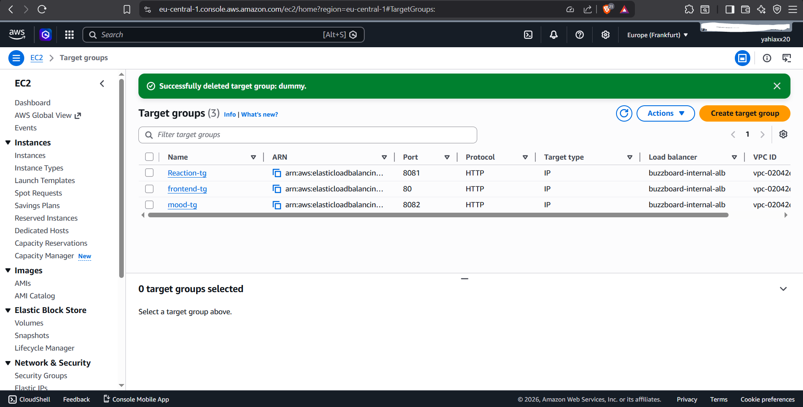
*Three IP‑based target groups: `Reaction-tg` (port 8081), `frontend-tg` (port 80), `mood-tg` (port 8082), all associated with the internal ALB.*

### 6. Load Balancer Detailed Rules (PDF)
[Load Balancer Detailed Rules](../screenshots/Load%20balancer%20details%20_%20EC2%20_%20eu-central-1.pdf)
*PDF export showing the four listener rules with path patterns and forwarding actions.*

---

## 🐳 Compute (ECS Fargate)

### 7. ECS Cluster & Services
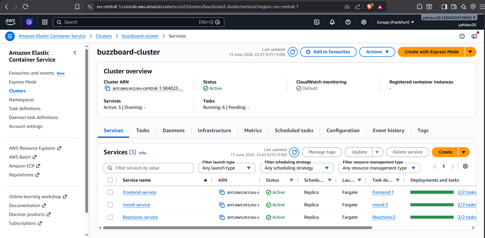
*ECS cluster `buzzboard-cluster` with three services: `frontend-service`, `mood-service`, `Reactions-service`. Each shows 2/2 tasks running.*

### 8. ECS Tasks (ECSTASKS.png)

*List of running ECS Fargate tasks for frontend, reactions, and mood services, with status `RUNNING`.*

---

## 🗄️ Data Tier

### 9. RDS MySQL Instance
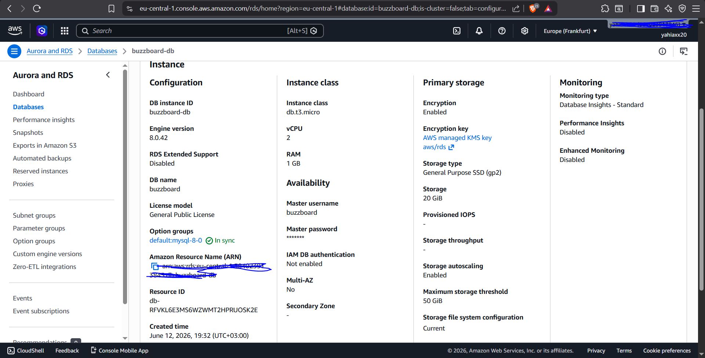
*RDS MySQL `bzubzboard-db` (db.t3.micro, engine 8.0.42). Single-AZ, storage encryption enabled, backup retention 7 days.*

### 10. ElastiCache Redis Cluster
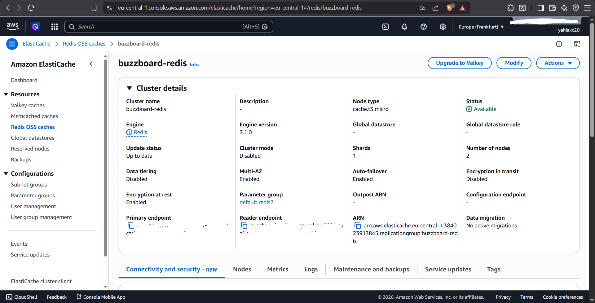
*Redis cluster `bazzboard-redis` with cluster mode disabled, 2 nodes (primary + replica), Multi-AZ enabled, auth token set.*

---

## 🔐 Security & Secrets

### 11. Secrets Manager
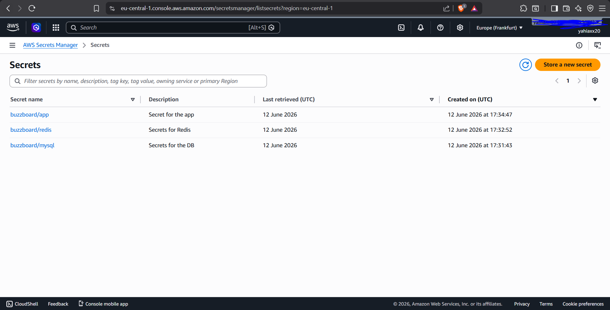
*Three secrets stored: `buzzboard/app` (JWT secret), `buzzboard/redis` (Redis credentials), `buzzboard/mysql` (database credentials).*

---

## 🌐 Public Entry Point

### 12. API Gateway (HTTP API)
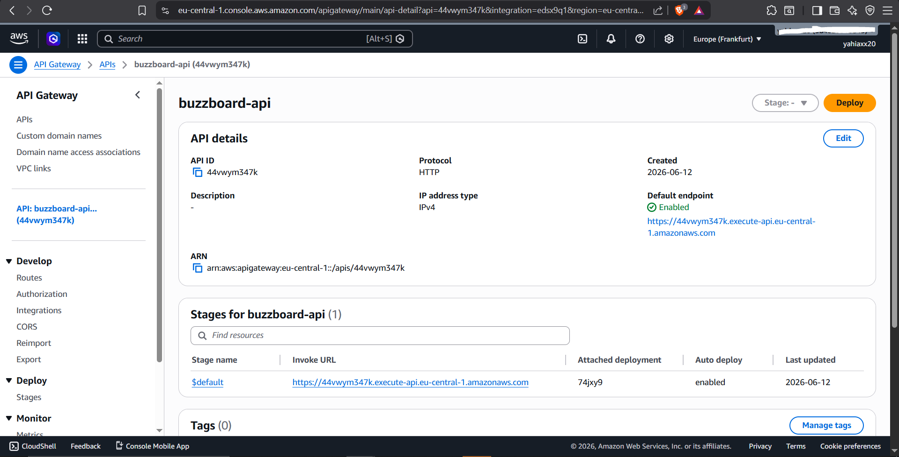
*HTTP API Gateway with public endpoint: `https://44wvym347k.execute-api.eu-central-1.amazonaws.com`. Stage `$default`, auto‑deploy enabled.*

---

## 📱 Application Frontend & Features

### 13. Sign‑Up Page
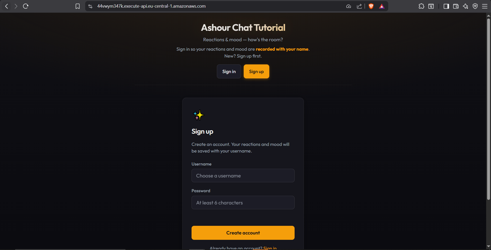
*User registration page – new users can create an account with username and password.*

### 14. Sign‑In Page
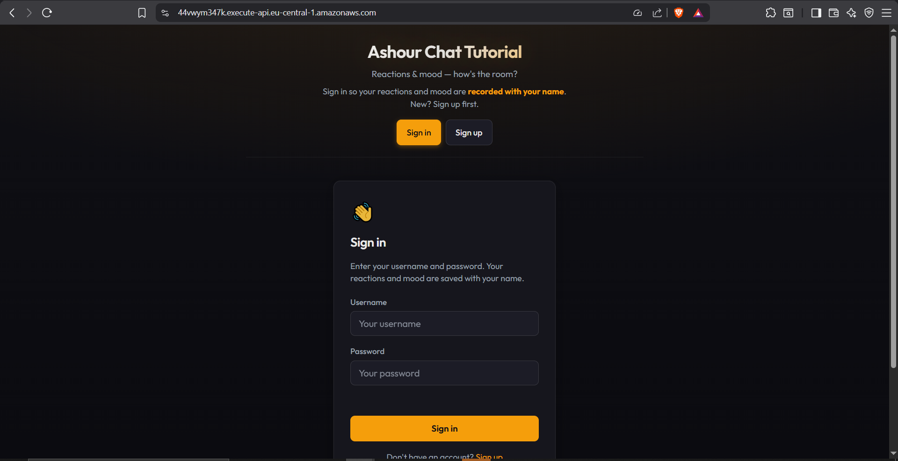
*User authentication page – sign in with username and password to receive a JWT token.*

### 15. Reactions Wall (MySQL)
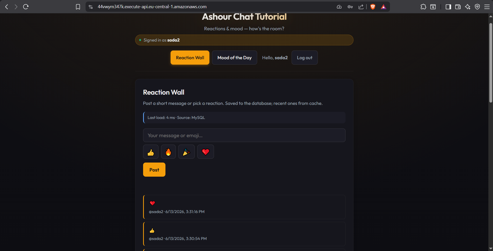
*Reaction Wall showing posts. Last load from MySQL (4 ms latency).*

### 16. Redis Cache Hit
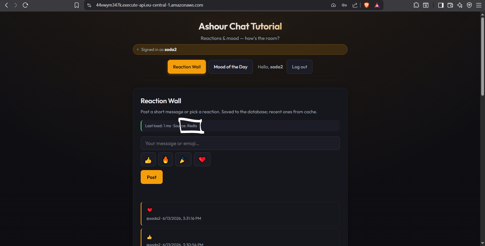
*When data is served from cache, the UI shows `Source: Redis` and lower latency (1 ms).*

### 17. Mood Tally
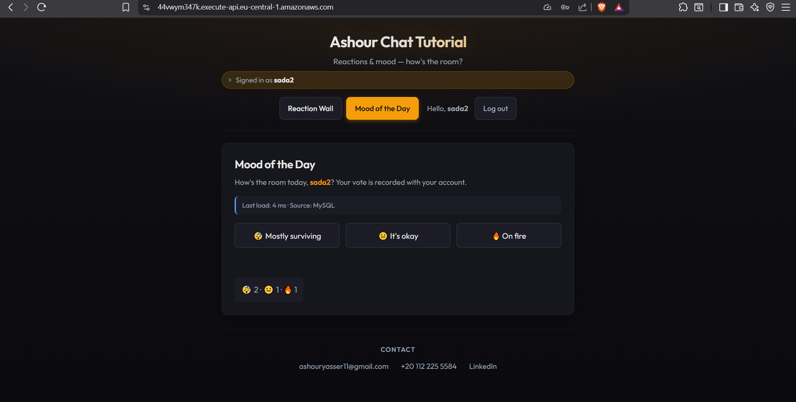
*Mood of the Day feature showing aggregated counts. This example shows `Source: MySQL` (cache miss).*

---

## 📊 Monitoring & Alerts

### 18. CloudWatch Alarms
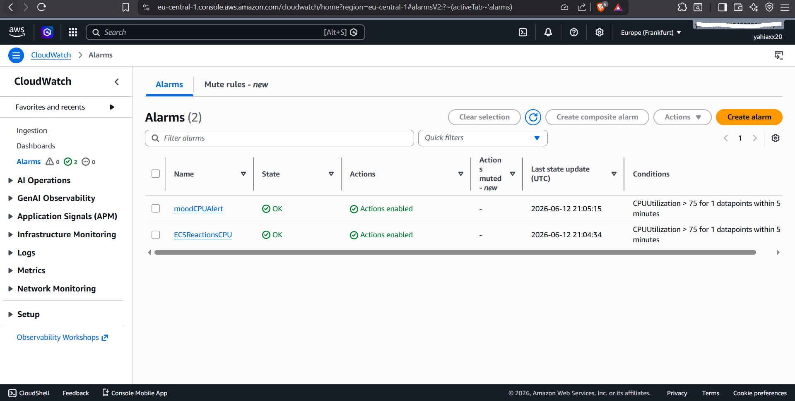
*Two alarms: `moodCPUAlert` and `ECSReactionsCPU` – both monitor CPUUtilisation > 75% for 1 datapoint within 5 minutes.*

### 19. SNS Topic – Email Alerts

*SNS topic `Buzzboard` with confirmed email subscription. Used to deliver CloudWatch alarm notifications.*

---

## ✅ Summary of Validated Functionality

| Area | Status |
|------|--------|
| VPC with private subnets | ✅ |
| VPC Endpoints (5) | ✅ |
| Security groups (7) | ✅ |
| Internal ALB + target groups | ✅ |
| ECS Fargate services (3) | ✅ |
| ECS tasks running (2 each) | ✅ |
| RDS MySQL operational | ✅ |
| ElastiCache Redis (primary + replica) | ✅ |
| Secrets Manager with 3 secrets | ✅ |
| API Gateway public URL | ✅ |
| Sign‑up / sign‑in working | ✅ |
| Reactions Wall (MySQL) | ✅ |
| Redis cache hit | ✅ |
| Mood tally aggregation | ✅ |
| CloudWatch alarms configured | ✅ |
| SNS email topic active | ✅ |

All components are deployed, integrated, and functioning as designed. The architecture is fully documented and ready for portfolio presentation.